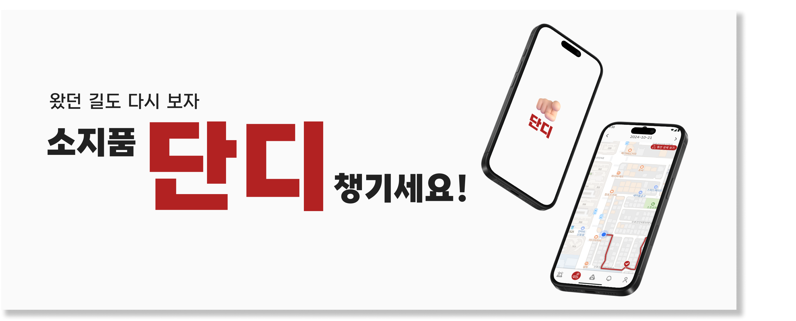
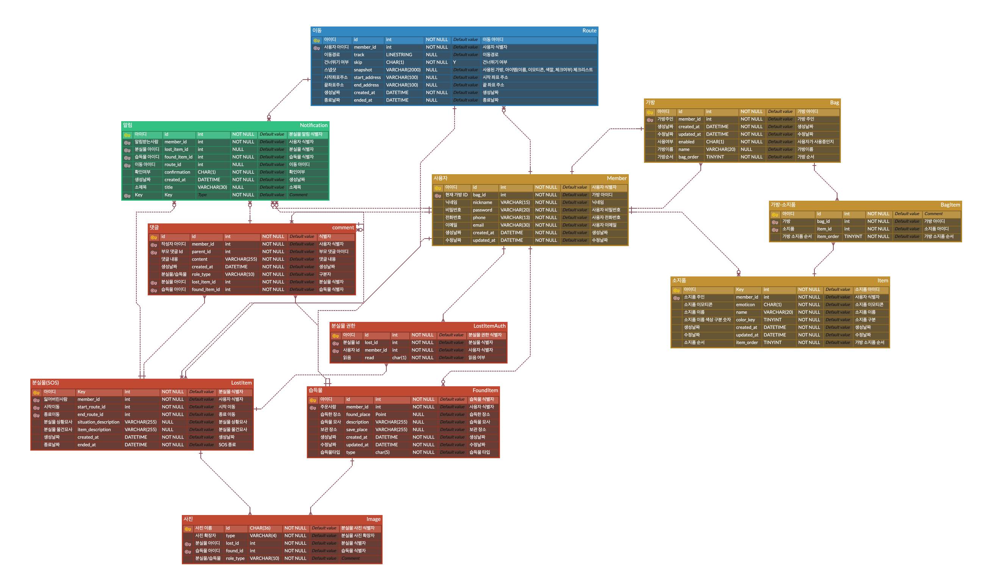
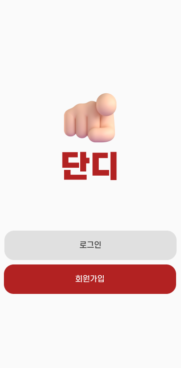
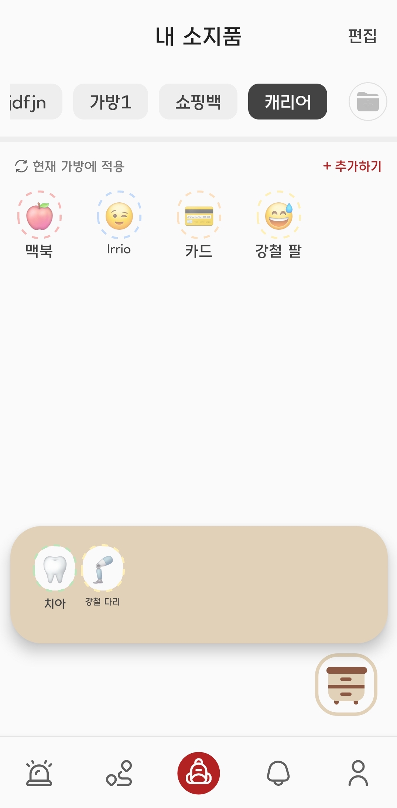
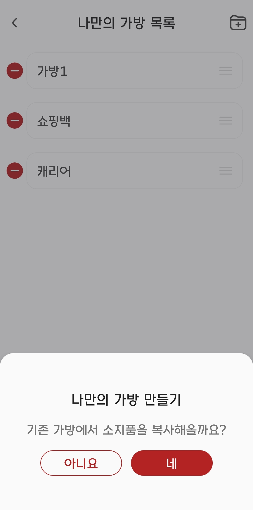
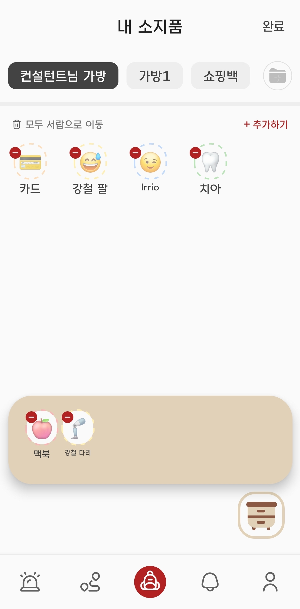
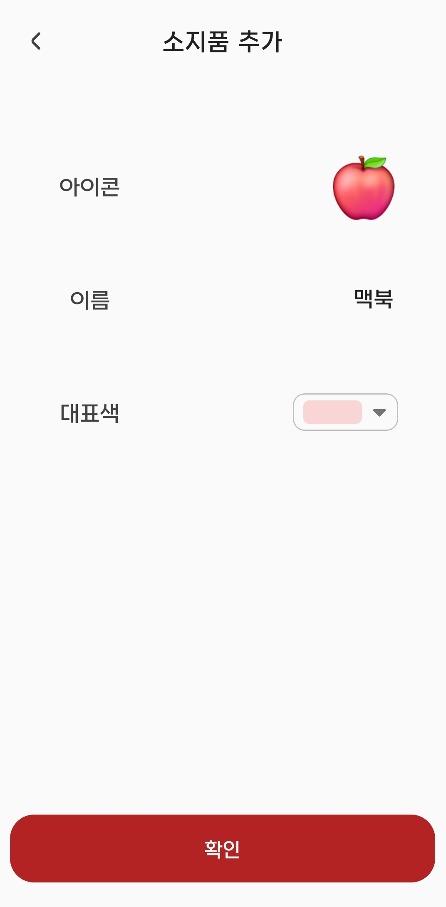
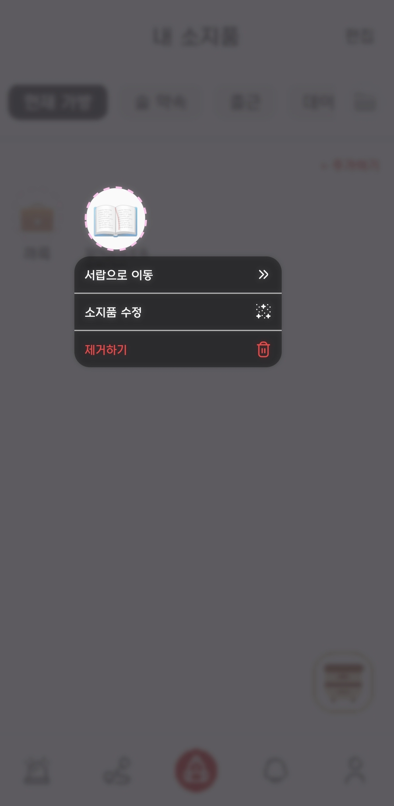
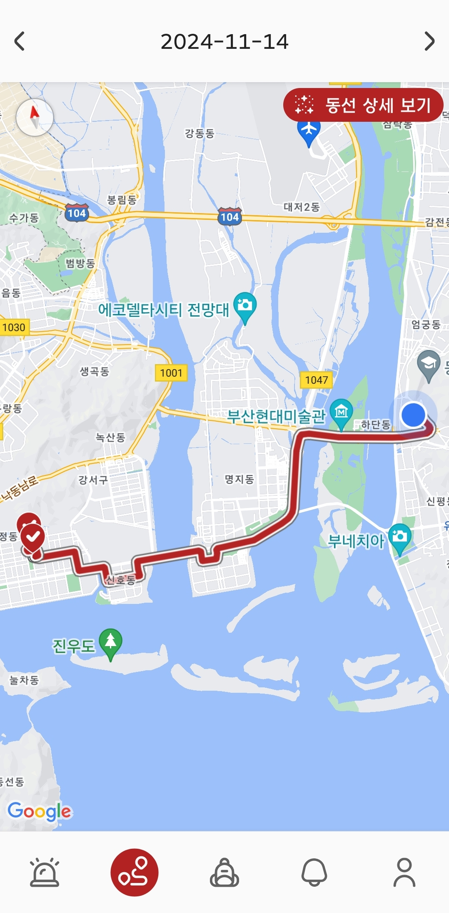
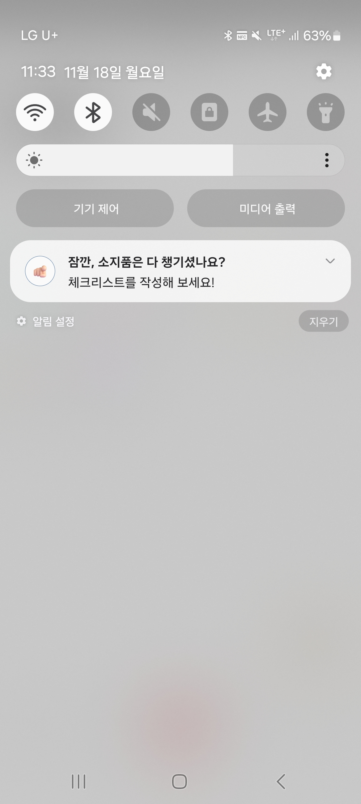

## 서비스명

> 단디

## 서비스 소개

> 외출 시 소지품 관리를 돕고 분실물 회수를 지원하는 애플리케이션

 

🙆‍♀️ **서비스 대상**

1. 소지품을 잘 잃어버리시는 분
2. 잃어버린 물건을 되찾은 적 없는 분
3. 길 가다 주운 분실물을 어찌할 줄 몰라 모른 척한 적 있는 분
    
    

💡 **주요 기능**

1. 소지품 등록 및 수정, 삭제
   > 들고 다닐 소지품들을 아이콘, 색상, 이름으로 구분할 수 있게끔 등록합니다.
2. 커스텀 가방 등록 및 수정, 삭제
   > 등교용/데이트용 등 용도별 커스텀 가방을 생성할 수 있습니다.
3. 위치 기반 이동 감지 및 소지품 알림
   > 사용자의 이동을 감지해 이동이 시작되면 현재 가방에 넣어둔 소지품을 모두 챙겼는지 체크 하기 위한 푸시 알림을 전송합니다.
4. 경로 확인 및 머무른 위치에서의 체크리스트 확인
   > 이동 감지로 저장된 경로를 확인하고, 이동 시작 시 체크 했던 체크리스트를 지점별로 확인할 수 있어요
5. SOS 등록
   > 내가 잃어버린 물건을 등록해 나와 경로가 겹치는 사용자에게 알림을 보낼 수 있습니다.
6. 분실물 등록
   > 주운 물건을 등록하면 습득 위치를 지나간 사용자에게만 보이는 글이 등록됩니다. 여기서 퀴즈를 맞힌 사람만 물건을 맡긴 위치를 확인할 수 있어요!

  

## 프로젝트 정보

📅 **진행 일정**

- 2024.10.14 ~ 2024.11.19 (총 5주)

👨‍👧‍👦 **팀원 소개**
| 윤대영 (팀장) | 권대호 | 김도예 | 송재원 | 이현수 | 홍성우 |
| --- | --- | --- | --- | --- | --- |
| FE | BE | FE | BE | BE | BE/Infra |

📁 **기획/설계 문서**

- [와이어프레임](https://www.figma.com/design/u5KP1sLXYu9uTQJwuTFPS3/dandi?node-id=0-1&t=guBrvHa3aIM75m43-1)

- ERD
  

🔨 **프론트엔드 기술 스택**

 

## 주요 기능 소개

|                 메인 홈                  |                  가방 메인                   |
| :--------------------------------------: | :------------------------------------------: |
|  |  |

|                 가방 만들기                  |                  편집 모드                   |
| :------------------------------------------: | :------------------------------------------: |
|  |  |

|                   소지품 생성                   |                  소지품 편집                  |
| :---------------------------------------------: | :-------------------------------------------: |
|  |  |

|                  내 경로                  |          이동 시작 시 체크 알림          |
| :---------------------------------------: | :--------------------------------------: |
|  |  |
